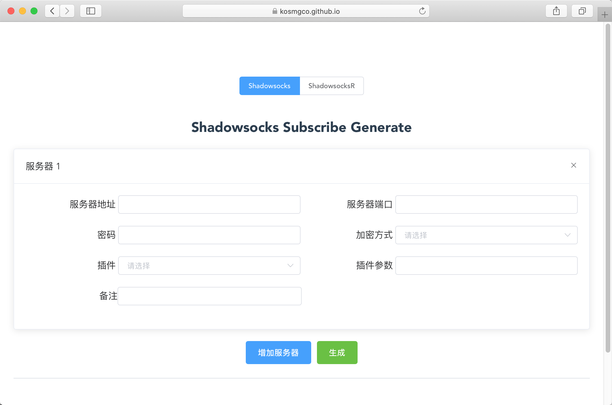

# ss-subscribe-gen

在线根据 ss/ssr 节点信息生成订阅内容，支持插件参数





Powered by Vue, ElementUI

view at [Shadowsocks/ShadowsocksR subscribe generate](https://kosmgco.github.io/ss-subscribe-gen/)


无网络请求，不会保存节点信息

### Supported method

- chacha20-ietf-poly1305
- aes-256-gcm
- aes-192-gcm
- aes-128-gcm
- aes-128-ctr
- aes-192-ctr
- aes-256-ctr
- aes-128-cfb
- aes-192-cfb
- aes-256-cfb
- camellia-128-cfb
- camellia-192-cfb
- camellia-256-cfb
- chacha20-ietf
- bf-cfb
- chacha20
- salsa20
- rc4-md5

### Supported plugin

- obfs-local
- simple-obfs
- v2ray-plugin
- kcptun


### Install

```
git clone https://github.com/kosmgco/ss-subscribe-gen.git
cd ss-subscribe-gen/
npm install
npm run serve
```

### TODO

- [ ] ShadowsocksR subscribe generate
